# Deep Learning on Image Denoising An overview is conducted by Chunwei Tian, Lunke Fei, Wenxian Zhang, Yong Xu, Wangmeng Zuo and Chia-Wen Lin and it is available at https://arxiv.org/abs/1912.13171. And it has been published by the Neural Networks (IF:5.535). Additionally, this paper has been pushed on the home page of the Neural Networks. 

## This paper is the first complete summary of deep learning for image denoising, which is very meaningful to readers.  

## It is reported by wechat public accounts at https://mp.weixin.qq.com/s/aaaaG5LkyWcJ9dhZ74Cp6A, https://mp.weixin.qq.com/s/nmKWJPbedGo1J8-oeIKm2w and https://mp.weixin.qq.com/s/hPaJssohwTIPx6kzGvp70g.

## Absract
#### Deep learning techniques have obtained much attention in image denoising. However, deep learning methods of different types deal with the noise have enormous differences. Specifically, discriminative learning based on deep learning can well address the Gaussian noise. Optimization model methods based on deep learning have good effect on estimating of the real noise. So far, there are little related researches to summarize different deep learning techniques for image denoising. In this paper, we make such a comparative study of different deep techniques in image denoising. We first classify the (1) deep convolutional neural networks (CNNs) for additive white noisy images, (2) deep CNNs for real noisy images, (3) deep CNNs for blind denoising and (4) deep CNNs for hybrid noisy images, which is the combination of noisy, blurred and low-resolution images. Then, we analyze the motivations and principles of deep learning methods of different types. Next, we compare and verify the state-of-the-art methods on public denoising datasets in terms of quantitative and qualitative analysis. Finally, we point out some potential challenges and directions of future research.

## The outline of this overview
### 

## CNN/NN for AWNI denoising
### 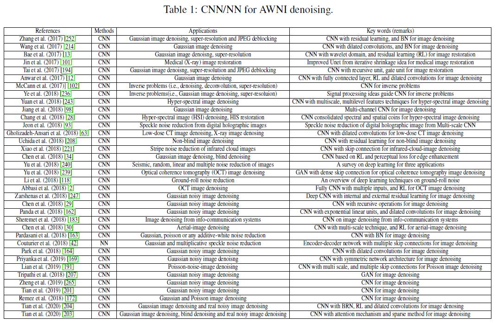

## CNN/NN and common feature extraction methods for AWNI denoising
### 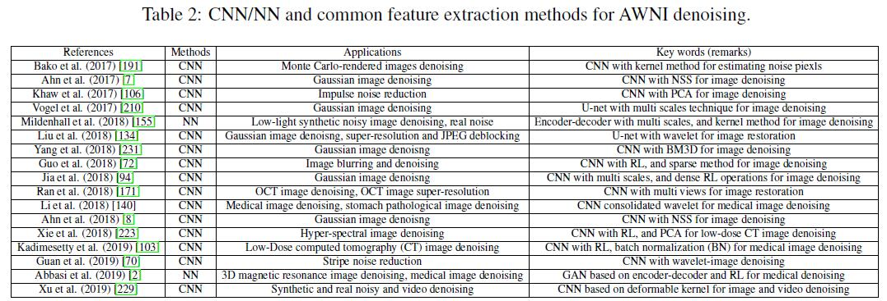

## The combination of the optimization method and CNN/NN for AWNI denoising
### 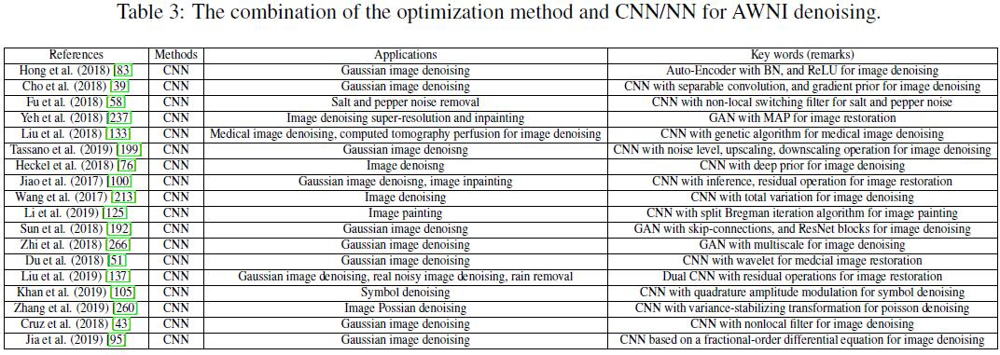

## CNNs based network architecture for real noisy image denoising
### 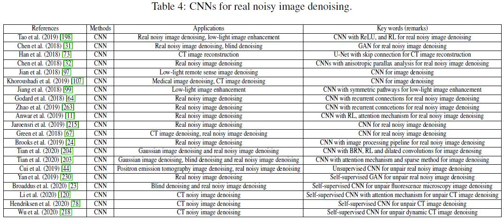

## CNNs based prior knowledge for real noisy image denoising
### 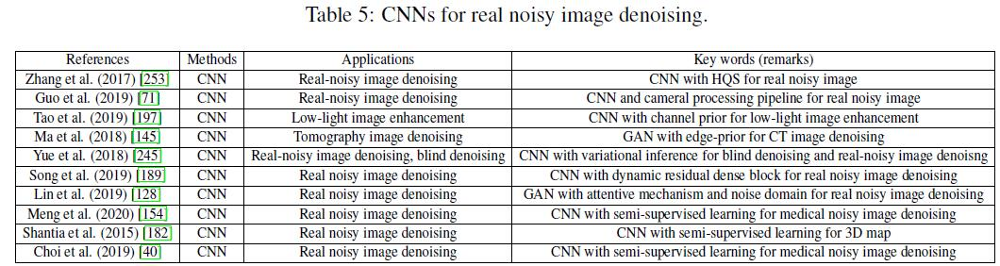

## Deep leaning techniques for blind denoising
### 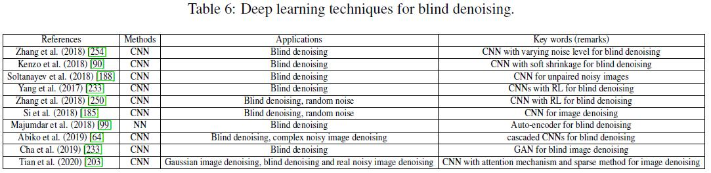

## Deep leaning techniques for hybrid noisy image denoising
### 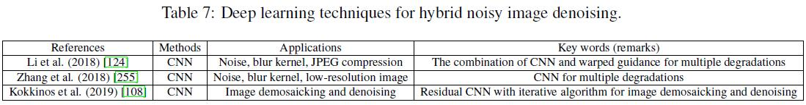

## Deep leaning techniques for burst denoising
### 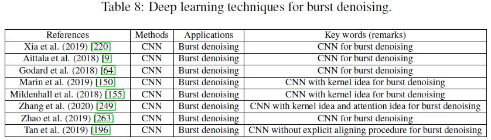

## Deep leaning techniques for video denoising
### 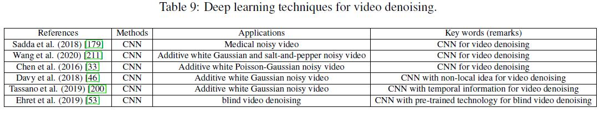

## PSNR (dB) of different methods on the BSD68 for different noise levels (i.e., 15, 25 and 50)
### 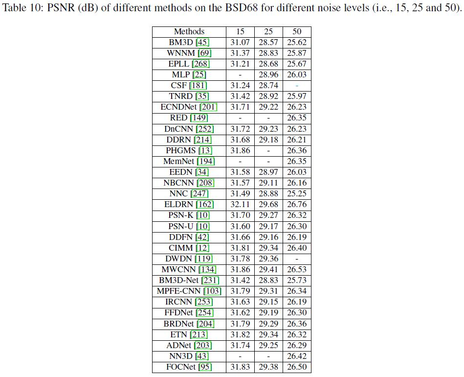

## FSIM of different methods on the BSD68 for different noise levels (i.e., 15, 25 and 50)
### 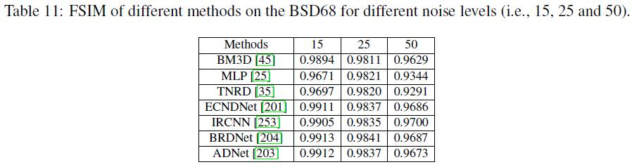

## PSNR (dB) for different methods on the Set12 for different noise levels (i.e., 15, 25 and 50)
### 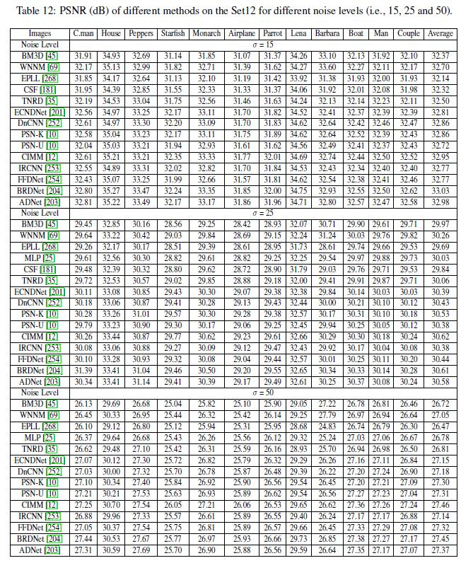

## PSNR (dB) for different methods on the CBSD68, Kodak24 and McMaster for different noise levels (i.e., 15, 25, 35, 50 and 75)
### 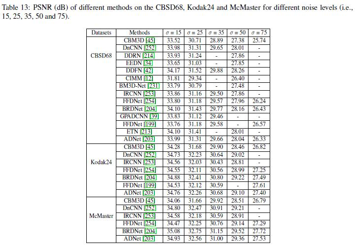

## Running time of 12 popular denoising methods for the noisy image of sizes 256x256, 512x512 and 1024x1024.
### 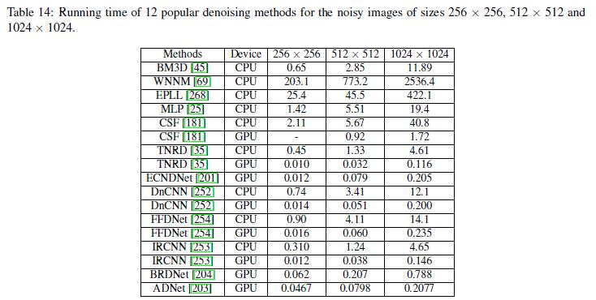

## PSNR (dB) of different methods on the DND for real-noisy image denoising.
### 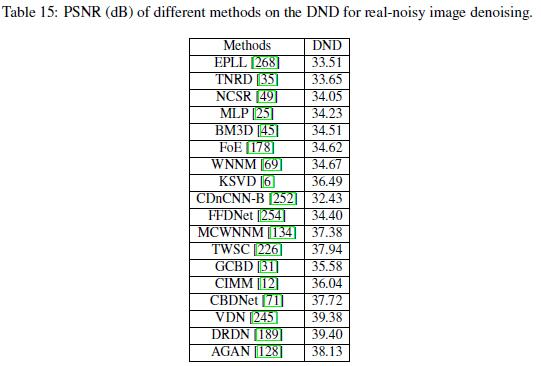

## PSNR (dB) of different methods on the SIDD for real-noisy image denoising.
### 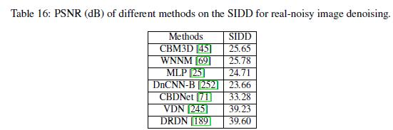

## PSNR (dB) of different methods on the Nam for real-noisy image denoising.
### 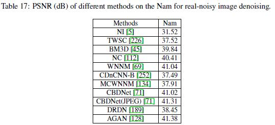

## PSNR (dB) of different methods on the CC for real-noisy image denoising.
### 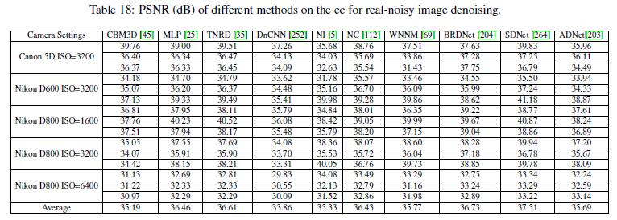

## Different methods on the BSD68 for different noise levels (i.e., 15, 25 and 50).
### 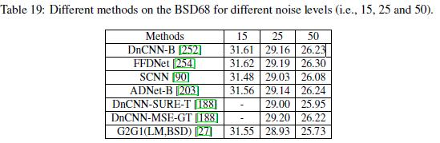

## Average PSNR (dB) results of different methods on Set12 with noise levels of 25 and 50.
### 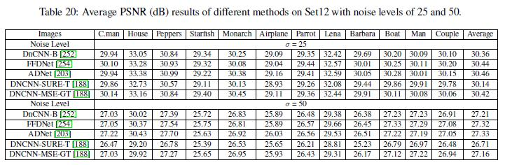

## Different methods on the VggFace12 and WebFace for image denoising
### 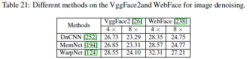

## Denoising results of different methods on one image from the BSD68 with noise level of 15: (a) original image, (b) noisy image/24.62dB, (c) BM3D/35.29dB, (d) EPLL/34.98dB, (e) DnCNN/36.20dB, (f) FFDNet/36.75dB, (g) IRCNN/35.94dB, (h) ECNDNet/36.03dB, and (i) BRDNet/36.59dB.
### 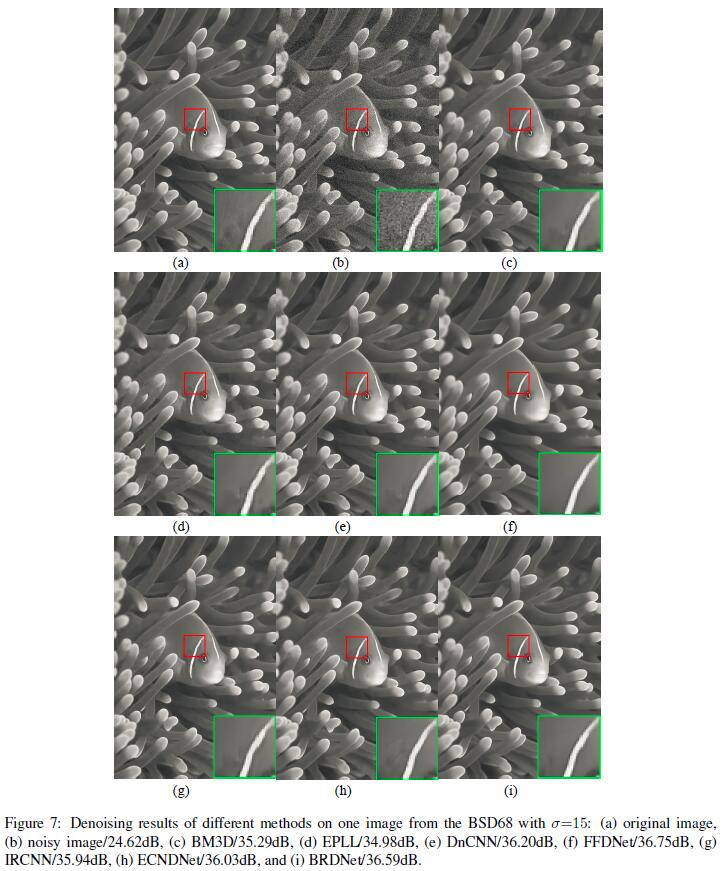

## Denoising results of different methods on one image from the Set12 with noise level of 25: (a) original image, (b) noisy image/20.22dB, (c) BM3D/29.26dB, (d) EPLL/29.44dB, (e) DnCNN/30.28B, (f) FFDNet/30.08dB, (g) IRCNN/30.09dB, (h) ECNDNet/30.30dB, and (i) BRDNet/30.50dB.
### 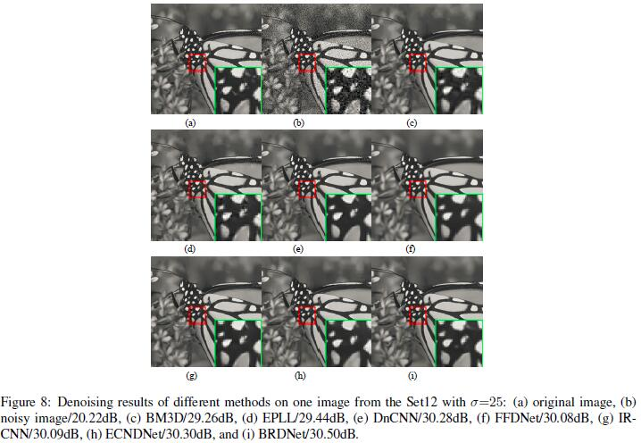

## Denoising results of different methods on one image from the MaMaster with noise level of 35: (a) original image, (b) noisy image/18.46dB, (c) DnCNN/33.05dB, (d) FFDNet/33.03dB, (e) IRCNN/32.74dB, and (f) BRDNet/33.26dB. 
### 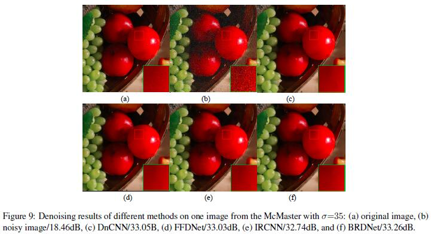

## Denoising results of different methods on one image from the MaMaster with noise level of 50: (a) original image, (b) noisy image/14.58dB, (c) DnCNN/25.80dB, (d) FFDNet/26.13dB, (e) IRCNN/26.10B, and (f) BRDNet/26.33dB. 
### 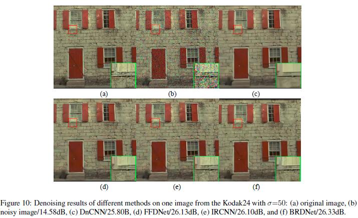

### Some popular denoiser based deep CNNs are shown as follows. 

### DnCNN can  be obtained at https://github.com/cszn/DnCNN.
### FFDNet can be obtained at https://github.com/cszn/FFDNet.
### IRCNN can be obtained at https://github.com/cszn/IRCNN.
### BRDNet can be obtained at https://github.com/hellloxiaotian/BRDNet.
### ADNet can be obtained at https://github.com/hellloxiaotian/ADNet.
### DudeNet can be obtained at https://github.com/hellloxiaotian/DudeNet.

### If you cite this paper, please refer to the following formats: 
#### 1.Tian C, Fei L, Zheng W, et al. Deep Learning on Image Denoising: An overview[J]. Neural Networks, 2020, 131,251-275.

#### 2. @article{tian2020deep,
####    title={Deep Learning on Image Denoising: An overview},
####    author={Tian, Chunwei and Fei, Lunke and Zheng, Wenxian and Xu, Yong and Zuo, Wangmeng and Lin, Chia-Wen},
####    journal={Neural Networks},
####    volume={131},
####    pages={251-275},
####    year={2020},
####    publisher={Elsevier}
####    }
